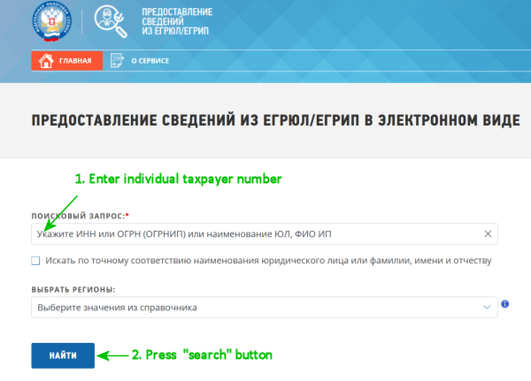

# Search for TINs in batch mode

## Contents
*    [Introduction](#introduction)
     *    [Search for the Taxpayer Identification Number (TIN)](#search-for-the-taxpayer-identification-number-tin)
     *    [One-by-one search implementation](#one-by-one-search-implementation)
*    [Prerequisites](#prerequisites)
*    [Possible search performance improvements](#possible-search-performance-improvements)
*    [Performance results](#performance-results)
*    [Script Operation Correctness](#script-operation-correctness)
*    [Run applications and tests](#run-applications-and-tests)
     *    [Run main appplication](#run-main-appplication)
     *    [Run tests](#run-tests)
     *    [Run ruff checks](#run-ruff-checks)
     *    [Run mypy checks](#run-mypy-checks)
*    [Project structure](#project-structure)

## Introduction

The proposed Python script can be very useful for 
accountants/administrative who need to verify the relevance of 
information for a large number of counterparties 
(e.g., sellers and buyers). This script allows you to 
find out whether a legal entity or individual is an 
active company (or a closed company), obtain 
the Registration Reason Code (КПП), 
and obtain company registration details.

## Search for the Taxpayer Identification Number (TIN)

The government website that provides information from the
Unified State Register of Legal Entities/Individual Entrepreneurs
requires the user to manually enter the taxpayer identification 
number (TIN) and click the "Find" button. The website will then 
display detailed information about the 
taxpayer (if the taxpayer identification number is found).

These manual steps can be illustrated in the screenshot below:


Some software products, such as `1C Bookkeeping` (1С Бухгалтерия), allow you 
to obtain detailed information about a single legal entity.
But sometimes you need to obtain this information for 
hundreds or thousands of companies at once.

This script automates work with the government website, 
allowing you to obtain detailed information about 
companies and individuals programmatically. 
Moreover, the script can process thousands of incoming 
taxpayer numbers and generate a CSV file with a table 
containing all incoming taxpayer numbers and detailed 
company information. The generated CSV file can then 
be opened in MS Excel for convenient further processing.

## One-by-one search implementation

Using Selenium WebDriver (initialized once for multiple requests),
open the Unified State Register of Legal Entities 
(/Individual Entrepreneurs) website
and enter the Taxpayer Identification Number (TIN) 
(programmatically) and click the Search button (programmatically). 
After receiving the result, in the HTML page, search for the 
response text and extract the legal entity status and 
registration/closure details. Script simulate two user actions, illustrated
above for any number of companies (specified by their TINs).

Some parts of code contains non-english text constants just for
user convenience.

# Prerequisites
Project was developed and tested under Windows 11.

Required software / packages:
1. python 3.10.
2. mypy 2.3.0
3. numpy 2.2.6
4. pandas 2.3.3
5. pytest 9.1.1
6. ruff 0.15.21
7. selenium 4.45.0


## Possible search performance improvements

Using futures.ProcessPoolExecutor is not applicable for this task, 
since the government website has protection against too 
frequent search requests coming from the same IP address.

## Performance results

1 company processed during 1.19 seconds approximately.

## Script Operation Correctness

Since the script uses internal data about the web page 
structure of the State Register of Legal Entities website, 
the script may stop working correctly in the future 
if the internal structure of the request and response page 
on the government website is changed. Last functional check
was performed in july 2026.

## Run applications and tests

### Run main appplication

From top root folder, run:
```
cd company_usrlc_scanner
python companies_scanner.py companies_468.csv
```

Note: files: `companies_468.csv` and `companies_9602.csv` aded
as examples of usage for real-life companies. Companies names
are anonimized intentionally.

Output file will be generated in the data/out folder.

### Run tests

In the project root folder

```
pytest
```

### Run ruff checks
In the root project folder run:
```
ruff check
```

### Run mypy checks
in the root project folder run:
```
mypy company_usrlc_scanner/companies_scanner.py
mypy tests/test_scan_short_list.py
```


### Project structure

```
root
  |-- company_usrlc_scanner
  |     |-- companies_scanner.py             Main script to search companies details
  |-- data
  |     |-- in
  |     |    |-- companies_468.csv           Example input file with 468 companies
  |     |    |-- companies_9602.csv          Example input file with 9602 companies
  |     |-- out                              Output CSV file(s) will be generated here
  |-- doc                                    Images for this documentation
  |-- tests
        |-- test_scan_short_list.py          Unit-test to check search performance

```
